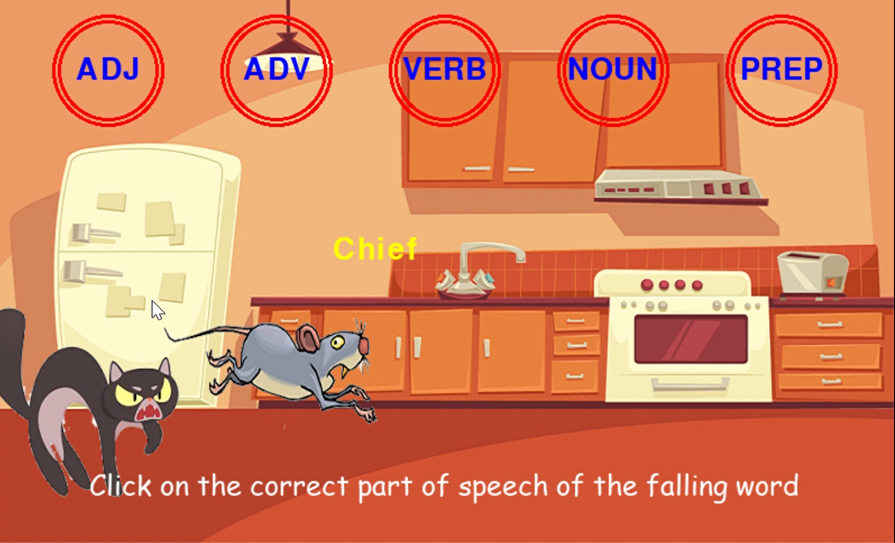

__Coursework Project - Linguistic Gaming with Python WS20/21__

Objectives of the game: 
  1. Answering correctly the part of speech of each target word.
  2. By doing so the mouse runs away from the chasing cat and eventaully arrives at the CheesneyLand.

